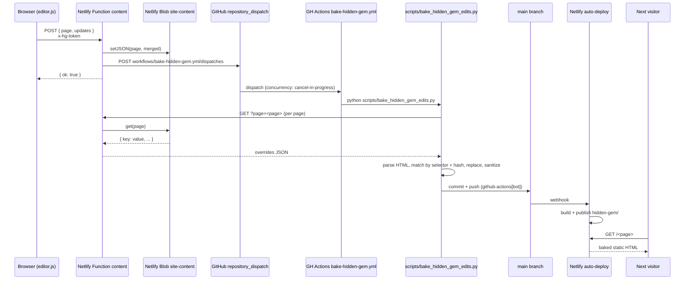

# Hidden Gem edit-flow architecture

This document explains how a content edit travels from Elena's browser to the live static site. It is the architectural reference for the Hidden Gem editor. For project context, see `CLAUDE.md` and `PROJECT_PLAN.md`. For operational concerns (env vars, deploy procedures, recovery), see `docs/runbook.md`.

## 1. Overview

The Hidden Gem site is a static multi-page site under `hidden-gem/` served from a Netlify site whose Base directory is `hidden-gem/` and Publish directory is `.`. Editing is a two-tier system: a runtime overlay layer that injects fresh edits onto every page view via a `fetch`-and-replace pass in `hidden-gem/js/editor.js`, and a slower bake layer that periodically rewrites the static HTML on disk so the overlay becomes a no-op. Edits live in Netlify Blob storage between those two layers. A GitHub Actions workflow drives the bake, triggered both hourly and by a `repository_dispatch` call from the Netlify Function that writes the blob. The result is that an edit shows up immediately for the next visitor (via the JS overlay) and gets persisted into git within roughly one minute (via the bake).



In parallel with the bake, anonymous visitors continue to hit `editor.js`'s `loadOverrides()` on every page load, which re-fetches the current `site-content` blob and re-applies it on top of whatever static HTML is currently deployed. The overlay and the bake are eventually consistent: if the bake is up to date, the overlay is a no-op; if the bake lags, the overlay keeps the rendered page current.

### Trust model in one paragraph

The OTP password is the entire trust boundary for writes. Anyone who knows the password (or a token minted from it) can POST to `content.mjs` and write arbitrary HTML into the `site-content` blob. That HTML is then injected as `el.innerHTML` on every page load (`hidden-gem/js/editor.js:191`) and as a BeautifulSoup-parsed fragment by the bake (`scripts/bake_hidden_gem_edits.py:225`) — neither side sanitizes against XSS, only against editor chrome. Widening the password set or weakening it via a default value (the `'chloe'` fallback in `otp.mjs:21`) widens the XSS surface accordingly. The fact that the static HTML is rebuilt on every bake makes injected content persistent, not transient.

## 2. The in-browser editor (`hidden-gem/js/editor.js`)

Every Hidden Gem page loads `hidden-gem/js/editor.js`. The script runs unconditionally for all visitors (anonymous and authenticated) and has two responsibilities: overlay the latest blob overrides on every page load, and gate an in-place editing UI behind a password.

### Editable element discovery

Two selector lists identify which DOM nodes can be edited:

- `EDITABLE_SELECTOR` (`hidden-gem/js/editor.js:33`) covers text blocks: `h1`-`h6`, `p`, `li`, `blockquote`, `figcaption`, `button`, `a.btn-primary`, `a.btn-secondary`, `a.btn-white`, `span.cred`, `div.hero-badge`.
- `EXT_EDITABLE_SELECTOR` (`hidden-gem/js/editor.js:45`) extends the set: `.section-label`, `.persona-tag`, `.ps-eyebrow`, `.faq-q`, `.faq-a`, `footer h4`, `footer p`, `footer a`. These are kept in a separate keying namespace so adding to this list doesn't shift existing blob keys.

`collectEditables()` (`hidden-gem/js/editor.js:53`) and `collectExtraEditables()` (`hidden-gem/js/editor.js:68`) walk the matched nodes, skip anything inside `#hg-editor-ui` or with an id starting with `hg-`, and freeze a `data-edit-key` attribute on each node. Images are discovered separately by `collectEditableImages()` (`hidden-gem/js/editor.js:122`), keyed positionally as `${pageKey}:img:${idx}`.

### Content-addressed key scheme

Edit keys are content-hashed, not positional. `hgHashContent()` (`hidden-gem/js/editor.js:97`) collapses whitespace and runs a DJB2 32-bit hash, then base-36 encodes the result. The resulting key shape is:

- `pageKey:h<hash>` for elements matched by the legacy `EDITABLE_SELECTOR`.
- `pageKey:ext:h<hash>` for elements matched only by `EXT_EDITABLE_SELECTOR`.

The hash is computed from the static HTML's text content on first load, before `loadOverrides()` mutates `innerHTML`, then frozen as `data-edit-key`. This is drift-resistant: if a developer re-orders sections, edits don't migrate to the wrong node — they stay attached to the node whose original text matches. If an editor deletes the surrounding context entirely so no DOM element hashes to the saved key, the bake script logs `no match in current DOM; skipping` and the static HTML wins (`scripts/bake_hidden_gem_edits.py:272`).

The page key itself comes from `<body data-page="...">` if set, otherwise the filename stem (`hidden-gem/js/editor.js:26`). One blob entry per page key, so `pageKey` determines which JSON object an edit belongs to and the rest of the key (`:h<hash>`, `:ext:h<hash>`, `:img:<idx>`) identifies the slot inside that object.

Concretely, the `site-content` blob entry for the home page looks like:

```json
{
  "home:h1abcd": "<replacement HTML for some matched element>",
  "home:ext:h2efgh": "<replacement HTML for some extended element>",
  "home:img:3": "/.netlify/functions/image?key=home%3Aimg%3A3&v=1716000000000"
}
```

The hash portion is whatever `hgHashContent(el.textContent)` produces against the element's original static-HTML text content. Image keys remain positional because the page has many `` elements and there is no stable text payload to hash — index-based keys are acceptable here because the bake also walks images positionally and the consequences of an image drift are visible immediately.

`data-edit-key` is the on-DOM mirror of the blob key. It is set once by `collectEditables()` and `collectExtraEditables()` and read by `loadOverrides()`, `enterEditMode()`, `saveChanges()`, and the reset-popover helpers. The attribute lives only in the in-page DOM after the editor has touched it; it never makes it to baked HTML because `neutralizeStaticEditorChrome()` and `sanitizeOverrideHTML()` strip it on the way out, and the bake script strips it on every load (`scripts/bake_hidden_gem_edits.py:80`). Editors that hand-write HTML into the static files should not set `data-edit-key` manually — let the JS issue the hash on first render. Same for `data-edit-img-key`.

### Startup lifecycle in order

For anyone tracing a single page load, the JS executes in this order:

1. `editor.js` script tag fires (defer or end-of-body — both pages currently put it near the end of `<body>`).
2. The IIFE at line 847 runs. `neutralizeStaticEditorChrome()` cleans any leaked attributes.
3. `loadOverrides()` is awaited. It calls `collectAllTextEditables()` and `collectEditableImages()` (which assigns `data-edit-key`s), then fetches the blob and overlays.
4. `mountFooterEditLink()` injects the footer link.
5. If `getToken()` returns a token, `collectAllTextEditables()` is called again (it's idempotent — already-keyed elements keep their keys) and `mountSaveBarUI()` builds `#hg-editor-ui` plus `#hg-save-bar` and starts lock polling.

Steps 1–4 happen for every visitor unconditionally. Step 5 only fires when a token is already in `sessionStorage`, i.e. the editor has signed in on a previous page of the same tab session.

### Overlay (anonymous read path)

The IIFE at `hidden-gem/js/editor.js:847` runs on every page load:

1. `neutralizeStaticEditorChrome()` strips any leaked `contenteditable`, `.hg-editable`, `data-edit-key`, and `data-start`/`-end`/`-is-only-node`/`-is-last-node` attributes from the static HTML (`hidden-gem/js/editor.js:742`). This is a belt-and-suspenders guard: the bake script is supposed to remove these too, but an unbaked tag accidentally committed by hand will still render cleanly for anonymous visitors.
2. `loadOverrides()` (`hidden-gem/js/editor.js:182`) `fetch`es `GET /.netlify/functions/content?page=<pageKey>` with `cache: 'no-store'`, then for every keyed text element sets `el.innerHTML = sanitizeOverrideHTML(data[key])`, and for every keyed image sets `img.src = data[key]`. `sanitizeOverrideHTML()` (`hidden-gem/js/editor.js:143`) re-runs the same cleanup as `neutralizeStaticEditorChrome` against the blob value before injection so stored chrome from older editor versions doesn't bleed into the rendered DOM. The fetch is non-blocking with respect to the rest of the page — there is no `await` at the script tag level, only inside the IIFE — so static content paints first and the overlay swaps in moments later.
3. `mountFooterEditLink()` adds an inline `edit` link in the footer-bottom (`hidden-gem/js/editor.js:791`), falling back to the bare `<footer>` if `.footer-bottom > div:last-child` is missing.

If the visitor has no token in `sessionStorage`, this is the entire pipeline they see: static HTML plus a blob overlay plus a discreet `edit` link. No save bar, no lock banner, no `#hg-editor-ui` injected — those mount lazily inside `mountSaveBarUI()` (`hidden-gem/js/editor.js:761`) only after a successful auth or when the IIFE detects a pre-existing token on init.

### Password-gated edit mode

Clicking the `edit` link runs `onEditClick()` (`hidden-gem/js/editor.js:698`). If `sessionStorage` already holds a token (`TOKEN_KEY = 'hg-edit-token'`), edit mode resumes; otherwise `openAuthModal()` (`hidden-gem/js/editor.js:633`) renders a password modal and POSTs the entered password to `/.netlify/functions/otp`. On a successful match the function returns `{ ok: true, token }`; the editor stashes the 32-hex token via `setToken()` (`hidden-gem/js/editor.js:206`) and attaches it as `x-hg-token` on every subsequent write through `authHeaders()` (`hidden-gem/js/editor.js:212`).

After auth, `tryAcquireLock()` (`hidden-gem/js/editor.js:260`) calls the `lock` function. If a fresh lock is held by someone else the user gets a `${holder} is currently editing` alert; otherwise `enterEditMode()` (`hidden-gem/js/editor.js:328`) snapshots `originalContent`, sets `contenteditable="true"` on every matched node, attaches the field-reset popover, swaps the link-click handler to `blockLinkNav()` so clicking a CTA inside an edit doesn't navigate the page, and starts a 30 s `LOCK_HEARTBEAT_MS` interval calling `refreshLock()`.

A separate 5 s interval `pollLockStatus()` (`hidden-gem/js/editor.js:289`) renders the "Someone is editing the site right now" banner for anyone else who is on the page and disables the footer `edit` link while another editor holds the lock.

### Save path

`saveChanges()` (`hidden-gem/js/editor.js:435`) builds a diff of `data-edit-key` -> `sanitizeOverrideHTML(innerHTML)` against the `originalContent` snapshot, POSTs `{ page, updates }` JSON to `/.netlify/functions/content`, then `releaseLock()`s and exits edit mode. Only entries whose value differs from the captured original are sent — unchanged elements stay out of the request payload, which keeps the merged blob entry close to a true diff rather than a snapshot of the whole page. Image edits are handled inline by `onImageClick()` (`hidden-gem/js/editor.js:385`) and `uploadImage()` (`hidden-gem/js/editor.js:402`), which POST a `multipart/form-data` payload to `/.netlify/functions/image` and rewrite the live ``'s `src` to the URL returned by that function (the URL itself points back at the `image` function, with a `?v=<ts>` cache-buster). Image uploads commit synchronously — by the time `uploadImage()` resolves, the blob and the live DOM are both updated and the change is visible to anyone who reloads the page. Text edits batch on the Save button.

`cancelEdit()` (`hidden-gem/js/editor.js:572`) restores `originalContent` to every node and releases the lock without writing. `resetPageOverrides()` (`hidden-gem/js/editor.js:544`) and `resetFieldFromPopover()` (`hidden-gem/js/editor.js:510`) DELETE the whole page or a single key from the blob, then `window.location.reload()`. A 401 from any write triggers `handleAuthExpired()` (`hidden-gem/js/editor.js:220`), which clears the token and re-prompts.

The `beforeunload` handler (`hidden-gem/js/editor.js:831`) uses `navigator.sendBeacon` to release the lock if the editor closes the tab mid-edit. The lock will time out on its own in 10 minutes regardless. `sendBeacon` cannot set custom headers, so the token is passed inside the JSON body — `lock.mjs` ignores it (no `x-hg-token` means a 401 response), but the lock-timeout fallback covers the gap. This is deliberate: the release-on-unload is a politeness, not a correctness requirement.

## 3. Netlify Functions (`hidden-gem/netlify/functions/`)

All four functions live in `hidden-gem/netlify/functions/` and are bundled with esbuild (`hidden-gem/netlify.toml:6`). They use `@netlify/blobs` for storage. All blob reads use `consistency: 'strong'` so a write is immediately visible to subsequent reads. Three of the four functions (`content`, `image`, `lock`) repeat the same `checkToken()` helper — a 32-hex regex check on the `x-hg-token` header followed by a strong-consistency read of `site-otp[token:${token}]` and a 4-hour TTL comparison against `rec.ts`. The helper is duplicated rather than shared because the functions are independently deployed bundles and Netlify Functions don't have a shared-module story without extra build wiring.

`hidden-gem/netlify.toml` configures `[build] publish = "."`, `[build] functions = "netlify/functions"`, and a pretty-URL rewrite `/:slug -> /:slug.html` with `force = false` so real files win over the rewrite. Function endpoints (`/.netlify/functions/*`) are handled natively by Netlify and intentionally are not rewritten — an earlier attempt to add a pass-through rule was rejected at build time.

### `content.mjs`

Reads/writes the `site-content` blob namespace. Validates tokens against the `site-otp` namespace.

- `GET ?page=<pageKey>` returns the page's full override map. Public.
- `POST { page, updates }` merges `updates` into the existing page blob entry via `{ ...existing, ...updates }` and fires `triggerBake('save:' + page)`. Requires `x-hg-token`.
- `DELETE ?page=<pageKey>` deletes the entire page blob entry. Fires `triggerBake('reset-page:' + page)`. Requires `x-hg-token`.
- `DELETE ?page=<pageKey>&key=<editKey>` removes a single key from the page entry. Fires `triggerBake('reset-field:' + page + ':' + key)`. Requires `x-hg-token`.

`checkToken()` (`hidden-gem/netlify/functions/content.mjs:69`) requires a 32-hex token whose `site-otp` record's `ts` is within `TOKEN_TTL_MS` (4 hours).

`triggerBake()` (`hidden-gem/netlify/functions/content.mjs:98`) POSTs to `https://api.github.com/repos/${GH_OWNER}/${GH_REPO}/actions/workflows/bake-hidden-gem.yml/dispatches` with `{ ref: 'main' }` using `GH_BAKE_PAT` as the bearer token. The call is fire-and-forget: the function's response to the editor is `{ ok: true }` without waiting for the dispatch. If `GH_BAKE_PAT` is unset, the dispatch silently no-ops — the hourly cron still bakes eventually, so editor saves are durable in blob storage even without GitHub credentials. The PAT requires either classic `repo` + `workflow` scopes or a fine-grained token with `actions: write` on the target repo.

**Reads/writes:** `site-content` (page overrides), `site-otp` (token validation).
**Env vars:** `GH_BAKE_PAT` (optional; without it, no instant bake), `GH_OWNER` (defaults to `ezradeantorres`), `GH_REPO` (defaults to `Vibe-1`).

### `image.mjs`

Stores and serves uploaded images. The store key is the full edit key (e.g. `home:img:2`).

- `GET ?key=<editKey>` returns the binary with the stored `contentType` metadata and `cache-control: public, max-age=604800`. Public.
- `POST multipart/form-data { page, editKey, file }` writes the bytes to `site-images`, then merges `{ [editKey]: '/.netlify/functions/image?key=<editKey>&v=<ts>' }` into the page's `site-content` entry so the URL persists across page loads. Requires `x-hg-token`. Rejects non-image MIME types and files over `MAX_BYTES = 10 MB`.

The `?v=<timestamp>` cache-buster lets the function set a 7-day `cache-control` on the GET while still ensuring fresh uploads invalidate the browser cache (the URL changes on every upload). Important consequence: the rendered `` initially points back at the function, not at a path on the static site, so an image is only fully durable once the bake has run and `bake_hidden_gem_edits.py` has downloaded the bytes into `hidden-gem/images/edits/` and rewritten the `src`. Until then, deletion of the `site-images` blob (or a Netlify outage) would 404 the image.

**Reads/writes:** `site-images` (binary bytes + contentType metadata), `site-content` (URL override), `site-otp` (token validation).
**Env vars:** none beyond Netlify's built-in blob credentials.

### `lock.mjs`

Single-editor lock to prevent two editors clobbering each other's edits. The lock is one row at `LOCK_KEY = 'editor'`.

- `GET` returns `{ active, userName, sessionId, ts }` for the current lock if it's within `LOCK_TIMEOUT_MS = 10 minutes`, otherwise `{ active: false }`. Public so every visitor can render the banner.
- `POST { action, sessionId, userName }` where `action` is `acquire`, `refresh`, or `release`. `acquire` succeeds if no fresh lock exists or the existing fresh lock belongs to `sessionId`; otherwise it returns `{ ok: false, holder: <userName> }`. `refresh` only succeeds for the current holder. `release` clears the lock if the caller is the holder. Requires `x-hg-token`.

`LOCK_TIMEOUT_MS` in `lock.mjs:12` must match the same constant in `editor.js:16`. If they drift, the client may think a lock is still fresh while the server expires it, or vice versa, producing surprising acquire-conflict races. The `LOCK_HEARTBEAT_MS = 30s` on the client (`editor.js:17`) is deliberately under one minute so an idle editor with a still-open tab cannot pass the 10-minute server timeout, which would otherwise let a second editor acquire the lock and overwrite the first one's in-progress changes.

**Reads/writes:** `site-locks` (lock state), `site-otp` (token validation).
**Env vars:** none.

### `otp.mjs`

Despite the name, this is a single-password sign-in, not an email OTP — the comment in `otp.mjs:11` notes that an earlier Resend-based email OTP flow was replaced because Resend's free tier requires domain verification. The endpoint name was kept so the other functions could keep reading `token:{token}` from the same blob namespace.

- `POST { password }` constant-time-compares against `process.env.EDITOR_PASSWORD`. If unset, the comparison falls back to the literal `'chloe'` (`FALLBACK_PASSWORD` at `hidden-gem/netlify/functions/otp.mjs:21`). On a match the function generates 16 random bytes (32 hex chars) via `node:crypto`, writes `{ ts: Date.now() }` to `site-otp` at `token:${token}`, and returns `{ ok: true, token }`. On a mismatch it returns `{ ok: false }` with status 401.

Token TTL is enforced by every consumer function (4 hours), not by a blob expiration — `site-otp` records are never deleted explicitly, but stale records are treated as invalid. The four-hour figure appears as `TOKEN_TTL_MS` in `otp.mjs:22`, `content.mjs:12`, `image.mjs:17`, and `lock.mjs:13`; if it diverges between files, writes may start succeeding or failing inconsistently depending on which function happens to handle a given request. Keep all four in sync.

Password comparison uses a constant-time XOR (`otp.mjs:43`) to avoid leaking the password length or prefix via timing. That said, password length is leaked via the function's own response latency in practice, so the constant-time helper is a defense-in-depth gesture rather than a cryptographic guarantee given Netlify's cold-start variance.

**Reads/writes:** `site-otp` (token mint).
**Env vars:** `EDITOR_PASSWORD` (optional; defaults to `'chloe'`).

## 4. The "bake" — turning blob edits into static HTML

The overlay layer is fast but transient. The bake makes blob edits durable by writing them into the HTML files on disk and committing to `main`.

### `.github/workflows/bake-hidden-gem.yml`

The workflow has three triggers:

- `workflow_dispatch` for manual runs from the GitHub Actions tab.
- `schedule: cron: '0 * * * *'` runs hourly. If there are no new edits the job runs and produces an empty diff, so the commit step is a no-op.
- `repository_dispatch` is implicit via the `workflows/bake-hidden-gem.yml/dispatches` REST endpoint, which `content.mjs:triggerBake` posts to on every save / reset.

`concurrency: { group: bake-hidden-gem, cancel-in-progress: true }` (`bake-hidden-gem.yml:19`) coalesces rapid-fire dispatches: while one bake is running, a new dispatch cancels it. This is intentional. The blob is the source of truth, so the only consequence of cancelling an in-flight bake is that the freshest snapshot wins. Without this, every save would queue a bake and editors typing through a paragraph would stack dozens of jobs.

Steps: `actions/checkout@v4`, `actions/setup-python@v5` (Python 3.12), `pip install requests beautifulsoup4`, `python scripts/bake_hidden_gem_edits.py`, then `git add hidden-gem/ && git diff --staged --quiet || (git commit && git push)` under the `github-actions[bot]` identity. The push to `main` triggers Netlify's auto-deploy.

### `scripts/bake_hidden_gem_edits.py`

For each page in `PAGE_FILES` (`scripts/bake_hidden_gem_edits.py:35`: `index.html`, `about.html`, `abbey.html`, `sara-equine.html`, `sara-psychiatric.html`, `sam-pediatric.html`, `kiera-aesthetics.html`):

1. Read the HTML with BeautifulSoup, pull the page key from `<body data-page="...">` via `get_page_key()` (`scripts/bake_hidden_gem_edits.py:122`).
2. Fetch the live overrides by HTTP GET against `https://hidden-gem-editable.netlify.app/.netlify/functions/content?page=<pageKey>` (`scripts/bake_hidden_gem_edits.py:167`). GitHub-hosted runners have unrestricted egress, which is why the bake runs here rather than in any Claude Code sandbox.
3. `collect_text_nodes()` and `collect_ext_text_nodes()` apply the same selectors and skip-rules as the JS side (`scripts/bake_hidden_gem_edits.py:148`).
4. Build hash-indexed lookups `text_by_hash` and `ext_by_hash` using `hg_hash_content()` (`scripts/bake_hidden_gem_edits.py:200`), a byte-for-byte port of the JS DJB2 hash.
5. For each `(key, val)` override, parse the key, find the matching node (image by positional index, text by hash), and call `_apply_text_value()` (`scripts/bake_hidden_gem_edits.py:221`), which clears the target, parses `sanitize_override_html(val)` into a fragment, appends the fragment, then `_unwrap_self_nested()` flattens any `<p><p>...</p></p>` residue. Hash misses log `no match in current DOM; skipping` and leave the static HTML untouched (`scripts/bake_hidden_gem_edits.py:272`).
6. Image overrides are downloaded to `hidden-gem/images/edits/` with the key as filename (`:` replaced with `_`), and the `` is rewritten to that relative path so the baked HTML no longer depends on the function URL.
7. Write the modified HTML back to disk via `path.write_text(str(soup), encoding="utf-8")` (`scripts/bake_hidden_gem_edits.py:358`). BeautifulSoup re-serializes the tree, which means even nodes the bake did not touch may be reformatted (attribute quoting, void-element self-closing, whitespace). This is the source of the bake-reformat churn called out in `CLAUDE.md` — manual HTML edits in flight when the bake runs will trigger conflicts on rebase.

The script prints a `text/ext/image baked` summary per page and a grand total. If `fetch_overrides()` returns 404 or an empty body for a page key (no entry in the blob), the page is skipped silently. If a page file is missing from disk, the script logs `Missing file, skipping` and continues with the rest — useful when adding a new page that doesn't yet exist on `main`.

### What the bake does not do

A few deliberate non-behaviors are worth flagging:

- The bake does **not** clear blob entries after baking them. The same override remains in `site-content` and is re-applied on every page load as an overlay. Because the static HTML now matches, the overlay is a no-op — `innerHTML` is set to a value identical to what's already rendered. This is harmless but it is the reason the blob grows monotonically over time.
- The bake does **not** sanitize against XSS or HTML-injection. `sanitize_override_html()` only strips editor chrome. Anyone who can POST to `content.mjs` (i.e. anyone who knows the editor password) can land arbitrary HTML into the static site on the next bake.
- The bake does **not** prune stale image files under `hidden-gem/images/edits/`. When an editor uploads a replacement for an existing image key, the new file overwrites the old (same filename: `<key-with-colons-replaced>.<ext>`), but extension changes (JPEG -> PNG) leave the old extension's file orphaned in the directory.
- The bake does **not** validate that selectors / hashes in the blob still map to elements in the HTML. Drift produces `no match in current DOM; skipping` log lines but no error exit — the bake will commit successfully even if every override missed.

### Critical invariant: keep editor.js and bake script in sync

The two sides of the bake-overlay handshake are wired together by three pieces of code that exist in both JavaScript and Python and **must match exactly**:

| Concern | `hidden-gem/js/editor.js` | `scripts/bake_hidden_gem_edits.py` |
|---|---|---|
| Primary selector list | `EDITABLE_SELECTOR` (line 33) | `EDITABLE_SELECTORS` (line 46) |
| Extended selector list | `EXT_EDITABLE_SELECTOR` (line 45) | `EXT_EDITABLE_SELECTORS` (line 57) |
| Hash function | `hgHashContent()` (line 97) | `hg_hash_content()` (line 200) |
| Override sanitizer | `sanitizeOverrideHTML()` (line 143) | `sanitize_override_html()` (line 64) |

If any of these drift, edits made in the browser get a hash for one selector set while the bake script looks them up against another. The overlay keeps working (the browser still hashes and looks up under the same definition), but the bake silently skips the unmatched keys — content fails to bake even though the editor reports success. The hash function in particular is unforgiving: any difference in whitespace handling or integer arithmetic produces a different key and a silent miss.

The sanitizer allowlist is part of this invariant. Both implementations strip the same attributes (`contenteditable`, `data-edit-key`, `data-start`/`data-end`/`data-is-only-node`/`data-is-last-node`), the same class (`.hg-editable`), the same `<div aria-hidden="true" class="pointer-events-none">` element, the same `<span style="background-color: ...">` declaration, and flatten the same nesting patterns. Adding sanitization on one side without porting it produces drift where the browser shows clean overlays but the baked HTML still contains junk (or vice versa).

When changing any of the four mirrored definitions, change both files in the same commit. The Python side has comments at each definition pointing back at the JS counterpart (and vice versa) — keep those comments accurate.

There is one asymmetry worth understanding: the JS side computes hashes from `el.textContent` (DOM property, which is the rendered text minus markup), while the Python side computes from `el.get_text()` (BeautifulSoup's equivalent). Both collapse runs of whitespace to single spaces and `.trim()` (`hgHashContent`) or `.strip()` (`hg_hash_content`). For elements whose inner HTML contains nested markup (e.g. a paragraph with a `<strong>` span), both implementations produce the same hash. For pathological cases where the rendered text differs from the parsed text — for instance, CSS-injected content — neither implementation will work, but the editor never writes such content into the blob in the first place.

### Why the bake URL crosses the public internet

`bake_hidden_gem_edits.py:34` defines `SITE = "https://hidden-gem-editable.netlify.app"` and `fetch_overrides()` hits the live function URL rather than reading the blob directly with `@netlify/blobs` from the GitHub runner. Two reasons: the runner has no Netlify credentials wired up (and adding them would mean managing a long-lived secret in GitHub), and the `content.mjs` GET path is already public, so no auth shenanigans are needed. The trade-off is that if the Hidden Gem Netlify deploy is down, the bake fails — but in that scenario the live site is also down, so the relative impact is small.

### Failure modes the pipeline tolerates

Each layer degrades to a useful state when its upstream is broken:

- **`GH_BAKE_PAT` missing or invalid**: `triggerBake()` no-ops. The hourly cron still bakes. Editor saves succeed and overlay correctly; they just don't appear in git until the next cron tick.
- **GitHub Actions outage**: same as above. Blob is the durable copy.
- **Netlify Functions cold-start latency**: the editor's `loadOverrides()` is async; if it stalls, the static HTML shows alone until the function returns. No visible error.
- **Blob read returns empty / not found**: `loadOverrides()` skips the page silently (`hidden-gem/js/editor.js:197`); the bake script logs `No overrides for page` and moves on (`scripts/bake_hidden_gem_edits.py:351`).
- **Token expired mid-edit**: the next write returns 401, which the heartbeat or the explicit save call catches, and `handleAuthExpired()` (`hidden-gem/js/editor.js:220`) prompts a re-sign-in. The in-flight edit content is preserved in the DOM but the save is rejected — the editor has to re-sign-in and click Save again.
- **Concurrent edit attempt**: the lock function returns `{ ok: false, holder: <name> }`. The second editor sees an alert with the holder's name and cannot enter edit mode. A stale lock times out in 10 minutes server-side.
- **Bake script crash**: GitHub Actions reports the failure; no commit is pushed. The next hourly run retries. Blob entries are not lost.
- **Editor.js fails to load** (network, parse error): the static HTML renders as the last baked snapshot; the footer `edit` link is absent, so the site is effectively read-only until the bake catches up.

## 5. Netlify Blob namespaces

All blobs live under the same Netlify site as the Hidden Gem deploy. Strong consistency is requested on every read.

| Namespace | Writers | Readers | Contents | Retention |
|---|---|---|---|---|
| `site-content` | `content.mjs` (POST/DELETE), `image.mjs` (POST — adds image URL to page entry) | `content.mjs` (GET), `bake_hidden_gem_edits.py` (via the `content` GET endpoint), `image.mjs` (POST, to merge URL override) | One JSON object per page, keyed by edit key (`pageKey:h<hash>`, `pageKey:ext:h<hash>`, or `pageKey:img:<idx>`). Values are the override HTML/text or the image URL. | Never expires. Grows monotonically as editors add new keys. Bake does not clear entries; the editor overlay applies them on top of identical static HTML, which is harmless. Explicit deletes via the editor's reset buttons are the only way to shrink it. |
| `site-images` | `image.mjs` (POST) | `image.mjs` (GET); `bake_hidden_gem_edits.py` downloads images via the `image` GET endpoint and re-saves them under `hidden-gem/images/edits/` | Binary image bytes keyed by the full edit key. Each entry carries a `contentType` metadata field. | Never expires. Old uploads stay around even after a key is overwritten with a new file. |
| `site-locks` | `lock.mjs` (POST) | `lock.mjs` (GET) | Single-row blob at key `editor` with `{ sessionId, userName, ts }`. | A lock is considered active only if `Date.now() - ts < LOCK_TIMEOUT_MS` (10 minutes). Stale rows remain in storage but are reported as inactive. |
| `site-otp` | `otp.mjs` (POST mints `token:<hex>` rows) | `content.mjs`, `image.mjs`, `lock.mjs` all read `token:<hex>` to validate the `x-hg-token` header | One row per minted token at key `token:${token}`, value `{ ts }`. | Token consumers reject any record whose `ts` is more than 4 hours old, but `otp.mjs` does not delete expired records. Old token rows accumulate; they are harmless but unbounded. |

## 6. Forms submissions (separate from the edit loop)

Booking is implemented as a native Netlify Form, not part of the edit pipeline. `hidden-gem/about.html` contains a `<form name="appointment" data-netlify="true" netlify-honeypot="bot-field" action="/about?submitted=true#contact" method="POST">`. Netlify intercepts the POST at the edge, parses the form by name, and routes the submission to the dashboard's Forms tab plus any configured email notification recipient.

This loop does not touch Netlify Blobs, does not invoke any function in `hidden-gem/netlify/functions/`, and does not trigger a bake. Submission recipients are configured in the Netlify dashboard's Forms settings — not in this repo. See `docs/runbook.md` for the dashboard config.

Two consequences worth noting for anyone working in this code:

- The `<form>` markup is itself editable through the overlay/bake pipeline if any of its children (a label, a button) match `EDITABLE_SELECTOR`. Editing label text in the editor will overlay/bake fine, but renaming the form's `name` attribute or changing its `action` cannot be done through the editor — those are markup-level changes that require a code edit and a deploy. Currently no UI surface lets editors do this, which is the intended boundary.
- Any change to `<form name="...">` requires updating the Netlify dashboard's per-form notification config to match the new name. Form detection at build time is positional by name, so renaming silently drops notifications until the dashboard is updated. Avoid renaming.

### Why four namespaces, not one

The four namespaces deliberately separate distinct lifecycles and access patterns:

- `site-content` is small JSON, read on every page view, written on every save — needs to be fast and is queried by page key.
- `site-images` is large binary, read with long cache-control, written rarely — different access pattern entirely.
- `site-locks` has exactly one logically-relevant row (`editor`), polled every 5 s by every active tab — separating it keeps the polling lookup small and avoids interleaving with the content blob.
- `site-otp` accumulates short-lived tokens — separating it keeps the content blob free of tokens, which never get sent to anonymous visitors via the public GET.

Operationally they are still all the same Netlify Blobs service, just different store names; the separation is logical, not infrastructural. A future cleanup could unify `site-otp` retention by deleting expired token records, but as long as the namespace stays small enough that strong-consistency reads remain fast, leaving it grow is acceptable.

## 7. The senior-living pipeline (status note)

`PROJECT_PLAN.md` specifies a separate pipeline for generating senior-living-community demo sites driven from `data/utah_communities.csv`. **That pipeline has not been built.** `src/__init__.py` and `src/lib/__init__.py` exist as empty stubs (0 bytes each). The only senior-living artifacts checked into the repo are the compliance scaffolding under `public/`:

- `public/_headers` sends `X-Robots-Tag: noindex,nofollow` plus `X-Frame-Options: SAMEORIGIN` and `Referrer-Policy: strict-origin-when-cross-origin` for every path.
- `public/robots.txt` disallows all crawlers (`User-agent: * / Disallow: /`).
- `public/index.html` is a generic placeholder served at the apex.

These deploy via a second Netlify site whose Base directory is the repo root and Publish directory is `public/`. The senior-living deploy is otherwise independent of everything described in sections 1-6, which all concern the Hidden Gem site at Base directory `hidden-gem/`. If or when the senior-living pipeline is built, see `PROJECT_PLAN.md` §5 for the intended design.

A note on the two-site repo layout: both Netlify sites point at the same `main` branch and the same repo, but with different Base/Publish directories. A push that touches only `hidden-gem/` still triggers builds on both sites, but the senior-living site only republishes when `public/` actually changes (and vice versa). The Hidden Gem editor pipeline never writes anything under `public/`, and the senior-living pipeline (when built) should never write anything under `hidden-gem/`. The `_headers` + `robots.txt` files inside `public/` are scoped to that publish directory and have no effect on Hidden Gem.

The Hidden Gem site is `public, indexable` — its own `hidden-gem/robots.txt` and `hidden-gem/sitemap.xml` permit crawling, and the `noindex` headers under `public/_headers` do not apply because they live in a different publish directory. If, while building the senior-living pipeline, someone needs to verify that `noindex` is actually being served for those demos, the check should run against the senior-living Netlify site URL specifically, not the Hidden Gem one.
